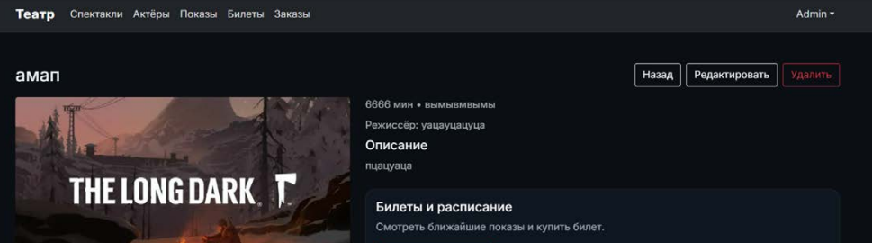
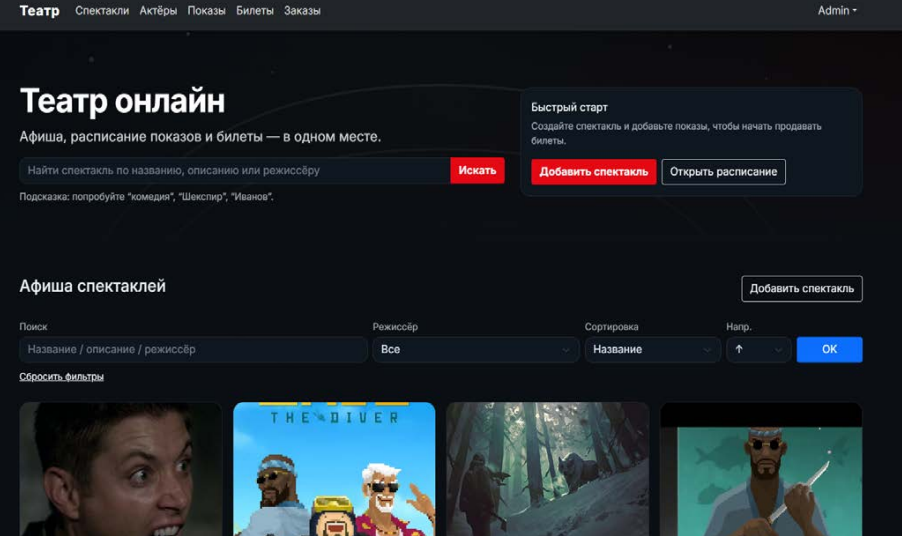
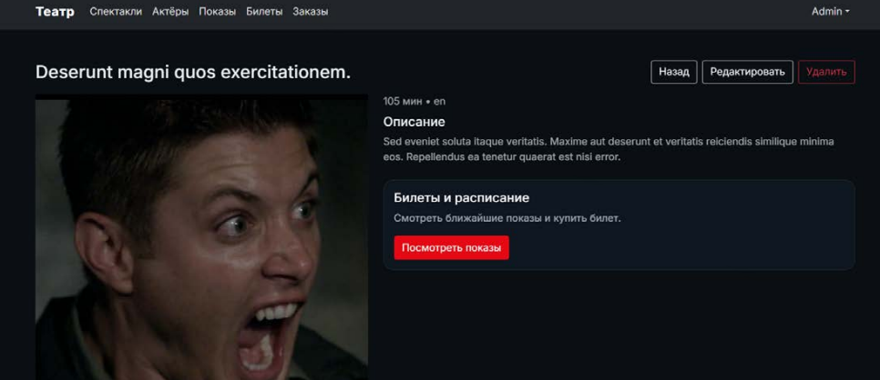
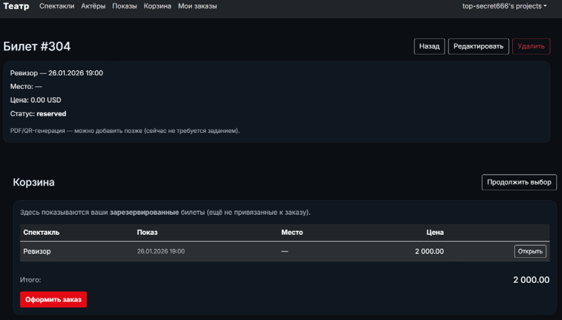
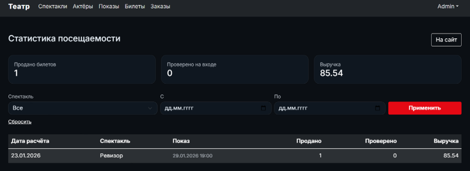

# Theater Box Office

<p align="center">

</p>

<p align="center">
  <b>Playbill · showtimes · tickets · orders — in one place</b><br/>
  A  Laravel web STUDY app for managing theater repertoire, performances, seat reservations, and sales analytics.
</p>

<p align="center">
  <a href="https://github.com/top-secret666/php"></a>
  
  
  
  
</p>

---

## Overview

**Theater Box Office** (*Театральная касса*) is a full-stack booking system for a theater:

- Browse the **playbill**, search productions, and open show pages with posters and descriptions
- Manage **actors**, **performances** (showtimes), **tickets**, and **orders**
- Reserve seats into a **cart**, then checkout into a paid order with QR codes
- Track **attendance and revenue** on an admin statistics dashboard

The runnable application lives in [`theater_full/`](theater_full/). Domain models, migrations, seeders, Docker setup, and ER diagrams are also available at the repository root.

---

## Screenshots

### Playbill & discovery

Dark-themed home screen with hero search, quick-start actions for admins, and a filterable playbill grid (by title, description, director, and sort order).

<p align="center">
  
### Show detail

Production page with poster, duration/language, description, and a call-to-action to open upcoming showtimes. Admins get edit and delete actions.

<p align="center">
  
</p>

### Tickets & shopping cart

Ticket detail (seat, price, status) plus the cart of reserved tickets that are not yet attached to an order — with total and **Place order** checkout.

<p align="center">
  
</p>

### Attendance statistics (admin)

KPI cards for tickets sold, entrance check-ins, and revenue, with filters by production and date range, plus a per-performance breakdown table.

<p align="center">
  
</p>

---

## Features

| Area | What you get |
| --- | --- |
| **Shows** | CRUD, poster upload, search/filter by title · description · director, sorting |
| **Actors** | Cast profiles linked to productions |
| **Performances** | Scheduled showtimes for each show |
| **Tickets** | Reserve / sell / cancel; unique seat per performance; optional check-in |
| **Cart & orders** | Reserved tickets → checkout → order; QR code issued on sale |
| **Admin stats** | Aggregated sold / checked-in / revenue via `performance_stats` |
| **Auth** | Login & registration; `is_admin` gate for mutating routes |
| **Quality** | FormRequest validation, PHPUnit tests, GitHub Actions CI |

---

## Tech stack

- **PHP 8.2+** · **Laravel 12** · Blade + Bootstrap (dark UI)
- **Eloquent ORM** · Form Requests · Policies / Admin middleware
- **PostgreSQL 14** (Docker) · SQLite supported in CI
- **Nginx + PHP-FPM** via Docker Compose
- **GitHub Actions** for install → migrate → test

---

## Domain model (short)

```text
Venue ──┬── SeatSection ── Seat
        └── Show ──┬── Actor (pivot: roles)
                   └── Performance ── Ticket ── Order
                                      └── PerformanceStat (sales / check-in / revenue)
```

Design artifacts in the repo:

- `theater_er_chen_conceptual.drawio` / `theater_er_chen_relational.drawio`
- `theater_uml_class.drawio` · `theater_app_structure.drawio`
- `theater_er_extended.md` · `theater_full/REPORT.md`

---

## Project layout

```text
.
├── theater_full/          # Full Laravel app (run this)
│   ├── app/               # Models, controllers, middleware, services
│   ├── database/          # Migrations & seeders
│   ├── resources/views/   # Blade templates
│   ├── routes/web.php
│   └── tests/
├── app/ · database/       # Shared scaffolding / models & migrations
├── docker/                # Compose: app, nginx, postgres
├── docs/screenshots/      # README screenshots
└── scripts/               # Local bootstrap helpers
```

---

## Getting started

### Requirements

- PHP **8.2+**, Composer, Node.js (optional frontend tooling)
- **Docker** & Docker Compose *(recommended)*  
  **or** a local PostgreSQL 14 instance

### Option A — Docker

```bash
cd docker
docker compose up -d --build
```

Then configure the app to use the Compose database:

| Variable | Value |
| --- | --- |
| `DB_CONNECTION` | `pgsql` |
| `DB_HOST` | `db` |
| `DB_PORT` | `5432` |
| `DB_DATABASE` | `theater_db` |
| `DB_USERNAME` | `postgres` |
| `DB_PASSWORD` | `secret` |

Inside the app container:

```bash
docker compose exec app bash
cd theater_full   # if your mount points at the repo root
composer install
cp .env.example .env
php artisan key:generate
php artisan migrate --seed
php artisan storage:link
```

Nginx is mapped to **http://localhost:8080**.

### Option B — Local Laravel

```bash
cd theater_full
composer install
cp .env.example .env
# set DB_* for your Postgres (or use sqlite for a quick try)
php artisan key:generate
php artisan migrate --seed
php artisan storage:link
php artisan serve
```

Open the URL printed by `artisan serve` (typically `http://127.0.0.1:8000`).

### Demo admin account

Seeded by `AdminUserSeeder`:

| Field | Value |
| --- | --- |
| Email | `admin@theater.local` |
| Password | `password` |

Change these credentials before any real deployment.

---

## Main routes

| Route | Description |
| --- | --- |
| `GET /` | Redirects to the playbill |
| `GET /shows` · `/shows/search` | Playbill + filters |
| `GET /shows/{show}` | Show detail |
| `GET /actors` · `/performances` · `/tickets` · `/orders` | Entity CRUD |
| `GET /cart` · `POST /cart/checkout` | Reserved tickets → order *(auth)* |
| `GET /admin/stats` | Attendance & revenue dashboard *(admin)* |
| `GET /login` · `/register` | Authentication |

---

## Testing & CI

```bash
cd theater_full
cp .env.example .env
touch database/database.sqlite
# point DB_CONNECTION=sqlite and DB_DATABASE=database/database.sqlite
php artisan key:generate
php artisan migrate:fresh --seed --force
php artisan test
```

GitHub Actions (`.github/workflows/ci.yml`) runs the same flow on every push and pull request to `main`.

---

## Ticket lifecycle

1. User picks a **performance** and reserves a seat → ticket `status = reserved`
2. Reserved tickets appear in the **cart** (not yet bound to an order)
3. **Checkout** creates an `Order`, marks tickets `sold`, sets `issued_at`, generates a **QR** code
4. At the door, staff can set `checked_in_at`
5. `PerformanceStatsUpdater` refreshes sold / checked-in / revenue aggregates for the admin dashboard

Double-booking is prevented with a unique constraint on `(performance_id, seat_id)`.

---

## License

This project is provided for educational / portfolio use. See repository terms if a license file is added later.

---

<p align="center">
  Built with Laravel · Designed for real theater workflows

  

</p>
